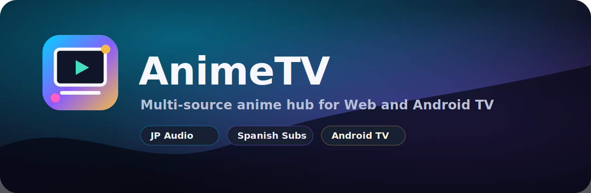

# AnimeTV



<p align="center">
  <strong>A modern anime hub for Web and Android TV with multi-source playback, Japanese audio preference, and Spanish subtitle support.</strong>
</p>

<p align="center">
  <a href="https://animetv-umber.vercel.app">Live Demo</a>
  ·
  <a href="docs/API.md">API Docs</a>
  ·
  <a href="docs/ANDROID_TV.md">Android TV</a>
  ·
  <a href="docs/TROUBLESHOOTING.md">Troubleshooting</a>
</p>

<p align="center">
  
  
  
  
</p>

## Highlights

- TV-first interface with compact sidebar navigation and remote-friendly focus states.
- Multi-source catalogs: AniList/Jikan metadata, AniPub, JIMOV/TioAnime, Anime1v, RapidAPI, and custom addons.
- Server picker per episode, with AniPub first when available and other playable sources added automatically.
- Embedded iframe playback and direct `<video>` playback stay separated for safety.
- Japanese audio and Spanish subtitles are the default playback preference.
- English subtitle tracks can be translated into Spanish for direct subtitle files.
- Favorites, watch history, resume positions, settings, light/dark theme, daily refresh, and Android TV wrapper.
- Windows launcher can supervise AnimeTV and Anime1v, restarting services after crashes.

## Live Deployment

Production is deployed on Vercel:

```text
https://animetv-umber.vercel.app
```

The app is also runnable locally at:

```text
http://127.0.0.1:4173
```

## Quick Start

```powershell
npm start
```

For the full local setup with server monitoring:

```powershell
.\start-all.bat
```

Useful options:

```powershell
.\start-all.bat -NoBrowser
.\start-all.bat -Anime1vPath "C:\anime1v-api"
```

## Build Android APK

```powershell
cd android
.\gradlew.bat assembleDebug
```

APK output:

```text
android\app\build\outputs\apk\debug\app-debug.apk
```

## Sources

| Source | Type | Playback | Notes |
| --- | --- | --- | --- |
| AniList + Jikan | Metadata | No video | High quality titles, images, scores, descriptions, and schedules. |
| AniPub | Online addon | Iframe | First fallback option when a matching episode exists. |
| Anime1v | Local API | Direct or iframe | Japanese audio + Spanish subtitle friendly when quota/providers allow. |
| JIMOV/TioAnime | Online addon | Direct or iframe | Spanish-friendly TioAnime connector. |
| RapidAPI Anime Streaming | API addon | Direct HLS/M3U8 when available | Requires `RAPIDAPI_ANIME_HOST` and `RAPIDAPI_ANIME_KEY`. |
| Custom sources | User configured | Direct or iframe | Add normalized JSON sources from the Sources screen. |

## Playback Safety

AnimeTV only sends direct `.mp4`, `.m3u8`, `videoUrl`, `streamUrl`, or `file` values to the main `<video>` player.

Iframe embeds are handled separately:

- Server returns `externalUrl` + `externalType: "iframe"`.
- Client detects iframe episodes before direct playback.
- Iframe embeds render inside the AnimeTV embedded iframe container.
- Direct video and iframe playback paths stay separate.

## Environment Variables

Copy `.env.example` to `.env.local` for local development.

```text
PORT=4173
ANIME1V_API=http://localhost:3001
ANIME1V_AUTO_START=true
RAPIDAPI_ANIME_HOST=your-rapidapi-host.p.rapidapi.com
RAPIDAPI_ANIME_KEY=your-rapidapi-key
RAPIDAPI_ANIME_TIMEOUT_MS=28000
UPDATE_REPO_URL=https://github.com/JSolanoDev/AnimeTV
```

## API

Core endpoints:

```text
GET /api/health
GET /api/catalog
GET /api/anipub/catalog/all?limit=12000
GET /api/anipub/episodes/:id
GET /api/anime1v/health
GET /api/anime1v/trending
GET /api/anime1v/search?q=naruto
GET /api/jimov/tioanime/catalog
GET /api/rapid-anime/health
GET /api/rapid-anime/catalog
GET /api/refresh-daily?background=1
```

More details are in [docs/API.md](docs/API.md).

## Project Structure

```text
AnimeTV/
├── animetv-local.js      # Local server entrypoint
├── animetv-server.js     # Shared API/server handler
├── client.js             # Frontend app
├── styles.css            # TV UI styling
├── sources.json          # Default source configuration
├── api/[...path].js      # Vercel API bridge
├── android/              # Android TV wrapper
├── docs/                 # Documentation and branding assets
└── scripts/              # Build helpers
```

## Development

```powershell
npm run check
npm run vercel-build
npm run android:build
```

## Maintainer

Built by [JSolanoDev](https://github.com/JSolanoDev).

## License

MIT. See [LICENSE](LICENSE).
